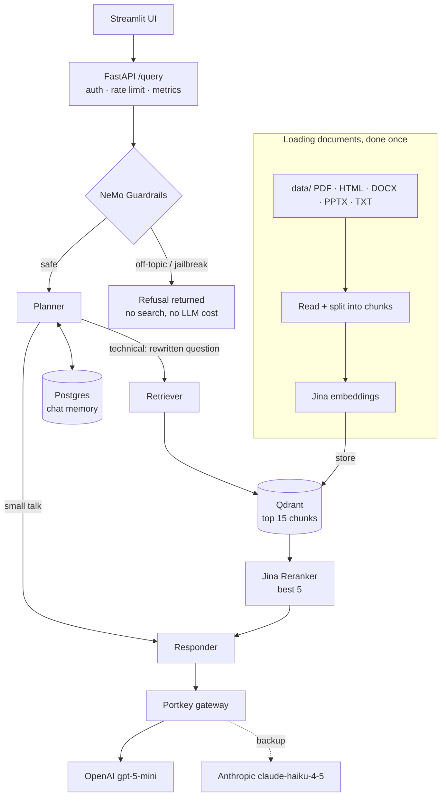
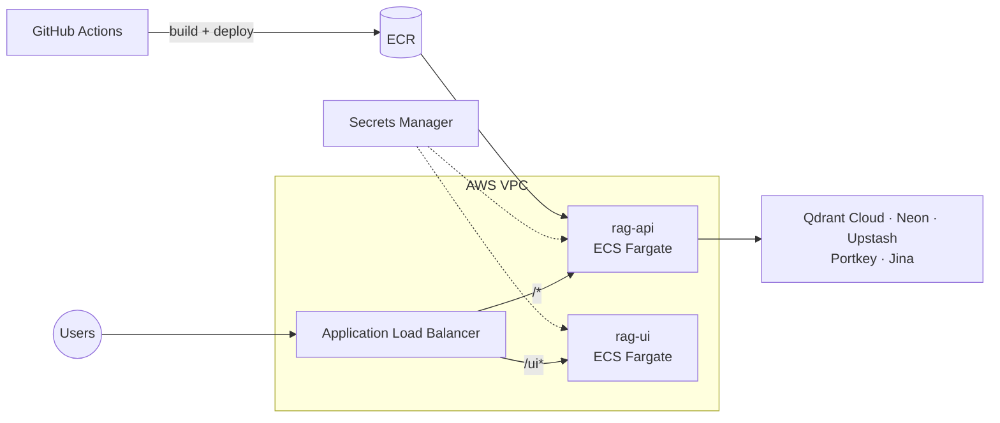

# Enterprise Agentic RAG

An AI assistant that answers questions about company technical documents. You ask a question, it finds the right parts of the documents and writes an answer from them.

It is built as an **agentic RAG** (Retrieval-Augmented Generation) system: a **LangGraph** agent first decides *whether* it needs to search the documents, then searches, then answers. Safety checks (**guardrails**) run before anything else, and every LLM call goes through a **gateway** that switches to a backup model if the main one fails.

The project also includes answer-quality **evaluation** (RAGAS), automated **tests**, **Docker** images and a **CI/CD** pipeline that deploys to **AWS ECS Fargate**.


## Contents

1. [The problem](#the-problem)
2. [Features](#features)
3. [How it works](#how-it-works)
4. [Edge cases handled](#edge-cases-handled)
5. [Tech stack](#tech-stack)
6. [Project structure](#project-structure)
7. [Getting started](#getting-started)
8. [API](#api)
9. [Evaluation](#evaluation)
10. [Testing and CI/CD](#testing-and-cicd)
11. [Deployment](#deployment)
12. [Documentation](#documentation)

## The problem

A simple RAG system (store documents, search them, send the results to an LLM) works in a demo but runs into problems in real use:

| Problem | Example |
|---|---|
| **Too many unrelated documents** | The answer is in 6 documents, but there are 58 other documents. Basic search often returns text that looks related but is wrong. |
| **Follow-up questions** | "How do I scale it?" makes no sense on its own. The system has to remember what "it" was. |
| **Misuse and wasted cost** | Off-topic questions or attempts to trick the AI ("ignore your instructions…") still trigger searches and paid LLM calls. |
| **Services go down** | If the LLM provider, embedding API or database fails, the whole app stops working. |
| **No way to measure quality** | Without a test set, nobody can tell if a change made answers better or worse. |

This project solves each of these. The test data mixes **6 Kubernetes documents** (the real knowledge) with **58 unrelated technical documents** (noise), so the search really has to find the right content.

## Features

- **Smart routing (agent):** a planner decides if a question needs a document search. Small talk skips the search, and follow-up questions are rewritten into full questions first.
- **Two-step search:** Qdrant (a **vector database**) finds the 15 closest text chunks, then a **reranker** picks the 5 most relevant.
- **Guardrails:** NeMo Guardrails blocks off-topic questions and **jailbreak / prompt-injection** attempts before any search or LLM call.
- **Backup LLM:** all LLM calls go through **Portkey**. If OpenAI fails, it switches to Anthropic automatically.
- **Conversation memory:** each chat thread's history is saved in **Postgres**, so the assistant remembers earlier messages.
- **Production-ready API:** API-key login, **rate limiting** with Redis, **health checks** and **Prometheus** metrics.
- **Monitoring:** every request is traced with **Logfire**, and every agent step with **LangSmith**.
- **Reads many file types:** PDF, HTML, DOCX, PPTX and TXT, all parsed locally.
- **Quality checks:** **RAGAS** scores the answers, and the guardrails are scored with **precision and recall**.
- **Automated delivery:** 31 tests, Docker, and **GitHub Actions** CI/CD to **AWS ECS Fargate**.

## How it works

### Answering a question



1. **Guardrails** check the question. Unsafe or off-topic questions get a polite refusal straight away. Greetings are answered directly.
2. The **planner** reads the chat history. It either marks the message as small talk or rewrites it into a clear search question.
3. The **retriever** searches Qdrant for the 15 closest chunks, and the **reranker** keeps the best 5. This filters out the unrelated documents.
4. The **responder** writes the answer from those 5 chunks and the chat history, using the LLM through Portkey.
5. The **API** returns the answer, the steps the agent took and the source chunks, and records metrics and traces.

### Deployment



## Edge cases handled

| What can go wrong | What the system does |
|---|---|
| Off-topic or prompt-injection question | Blocked by the guardrails and counted in the `guardrails_blocks_total` metric |
| Follow-up question that depends on earlier messages | The planner rewrites it into a complete question using the saved chat history |
| Greeting, or a question already answered in the chat | Skips the document search completely |
| Main LLM provider (OpenAI) fails | Portkey switches to the backup (Anthropic) |
| Jina embeddings API is down | Uses a local model (`mxbai-embed-large-v1`) with the same vector size (1024) |
| Reranker fails | Keeps the original search order instead of failing |
| Qdrant search fails | Retries with increasing wait times (**exponential backoff**), then continues with no context instead of crashing |
| Postgres is down at startup | Keeps chat memory in RAM instead and logs a warning |
| Neon (cloud Postgres) closes idle connections | Connections are health-checked and kept alive automatically |
| Neon rejects a database setup step inside a transaction | That setup step runs on a separate connection |
| Redis is down | Rate limiting falls back to in-memory storage |
| Too much text retrieved | Cut down to 25,000 characters before sending to the LLM |
| PDF page with no readable text | Tried again with a second PDF reader (`pdfplumber`) |
| Unexpected error | Returns a `500` error with a request ID, without exposing internal details |
| A dependency is down in production | `/ready` returns `503` and names the failing service; `STRICT_STARTUP=true` stops the app from starting |

## Tech stack

| Area | Tools |
|---|---|
| API and UI | FastAPI, Uvicorn, SlowAPI, Streamlit |
| Agent | LangGraph, LangChain |
| LLMs | OpenAI `gpt-5-mini` (main), Anthropic `claude-haiku-4-5` (backup) |
| LLM gateway | Portkey |
| Guardrails | NVIDIA NeMo Guardrails |
| Embeddings and reranking | Jina `jina-embeddings-v3`, Jina `jina-reranker-v3` |
| Vector database | Qdrant Cloud |
| Storage | Neon Postgres (chat memory), Upstash Redis (rate limits) |
| Document reading | pypdf, pdfplumber, BeautifulSoup, unstructured |
| Monitoring | Pydantic Logfire, LangSmith, Prometheus |
| Testing and quality | RAGAS, pytest, Ruff, Locust |
| Cloud and DevOps | Docker, GitHub Actions, AWS ECS Fargate, ALB, ECR, Secrets Manager |

## Project structure

```text
.
├── .aws/task-definitions/         # ECS settings for the API and UI containers
├── .github/workflows/
│   ├── ci.yml                     # Runs lint + tests on every push / pull request
│   └── cd.yml                     # Builds the image, pushes to ECR, deploys to ECS
├── app/                           # Main application
│   ├── agents/
│   │   ├── nodes/
│   │   │   ├── planner.py         # Decides: search or not, and rewrites the question
│   │   │   ├── retriever.py       # Searches Qdrant and reranks results
│   │   │   └── responder.py       # Writes the final answer
│   │   ├── graph.py               # Connects the agent steps + saves chat memory
│   │   └── state.py               # Data shared between agent steps
│   ├── gateway/client.py          # Portkey LLM gateway
│   ├── guardrails/
│   │   ├── colang_rules.py        # Guardrail rules (off-topic, jailbreak, greetings)
│   │   └── rails.py               # Loads and runs the guardrails
│   ├── ingestion/
│   │   ├── chunking/splitter.py   # Splits text into chunks
│   │   ├── loaders/               # Readers for PDF, HTML, Office and text files
│   │   └── processor.py           # Loads documents: read → split → embed → store
│   ├── services/
│   │   ├── health/connection_checker.py   # Checks every external service
│   │   └── retrieval/
│   │       ├── embedding.py       # Jina embeddings (with local backup model)
│   │       ├── qdrant_service.py  # Vector search (with retries)
│   │       └── ranking_service.py # Reranking (with fallback)
│   ├── config.py                  # Settings loaded from .env
│   ├── health.py                  # /health and /ready endpoints
│   ├── logging.py                 # Request IDs for logs
│   └── main.py                    # FastAPI app and the /query endpoint
├── data/
│   ├── true_data/                 # Kubernetes documents (the real knowledge)
│   └── noisy_data/                # Unrelated documents (noise)
├── docs/                          # Architecture, deployment and testing guides
├── evals/                         # Answer-quality evaluation
│   ├── datasets/golden_dataset.json   # Test questions with correct answers
│   ├── pipeline.py                # Sends test questions to the API
│   ├── metrics.py                 # Scores answers with RAGAS
│   ├── guardrails_eval.py         # Scores the guardrails
│   ├── run_evals.py               # Runs everything from the command line
│   ├── app.py                     # Evaluation dashboard (Streamlit)
│   └── data_parser.py             # Reads documents for evaluation
├── scripts/
│   ├── deployment/                # AWS setup, secrets and teardown scripts
│   └── testing/                   # Load test and Portkey helper
├── tests/                         # Automated tests (no internet needed)
├── ui/
│   ├── app.py                     # Chat interface (Streamlit)
│   └── st_cloud_ui.py             # Version for Streamlit Cloud
├── .env.example                   # Template for your settings
├── Dockerfile                     # Builds the app image
├── docker-compose.yml             # Runs API + UI locally in containers
├── pyproject.toml                 # Project and dependency settings
├── requirements.txt               # Everything needed for development
├── requirements-prod.txt          # Only what the app needs to run
└── uv.lock                        # Exact dependency versions
```

## Getting started

### What you need

- Python 3.11 or newer
- Accounts for OpenAI, Portkey, Jina AI, Qdrant Cloud, Neon and Upstash
- Docker (optional)

### 1. Install

```bash
git clone https://github.com/UtkarshReddyNathala/Agentic-RAG-System-with-Guardrails-Deployment-.git
cd Agentic-RAG-System-with-Guardrails-Deployment-
python -m venv .venv && source .venv/bin/activate     # Windows: .venv\Scripts\activate
pip install -r requirements.txt
```

### 2. Add your settings

```bash
cp .env.example .env
```

Then fill in `.env`:

| Setting | What it is for |
|---|---|
| `OPENAI_API_KEY` | Guardrails and the evaluation judge |
| `PORTKEY_API_KEY`, `PORTKEY_PRIMARY_CONFIG_ID` | Portkey gateway key and its routing config ID (`pc-…`) |
| `PORTKEY_PRIMARY_SLUG`, `PORTKEY_FALLBACK_SLUG` | Model provider names in Portkey (default `openai-primary`, `anthropic-fallback`) |
| `JINA_API_KEY` | Embeddings and reranking |
| `QDRANT_CLUSTER_ENDPOINT`, `QDRANT_API_KEY` | Vector database |
| `NEON_DB_URL` | Postgres for chat memory |
| `UPSTASH_REDIS_REST_URL`, `UPSTASH_REDIS_REST_TOKEN` | Redis for rate limiting |
| `RAG_API_KEY` | Password for the API; leave empty to turn off login locally |
| `RATE_LIMIT_PER_MINUTE` | Requests allowed per user per minute (default 20) |
| `LOGFIRE_TOKEN`, `LANGSMITH_API_KEY` | Monitoring (optional) |

Check that every service is reachable:

```bash
python -m app.services.health.connection_checker
```

### 3. Load the documents

```bash
python -m app.ingestion.processor data --wipe
```

This reads every file in `data/`, splits it into chunks, turns the chunks into embeddings and stores them in Qdrant. `--wipe` clears the old data first.

### 4. Start the app

```bash
uvicorn app.main:app --port 8000      # API
streamlit run ui/app.py               # Chat UI (in a second terminal)
```

Or start both with Docker:

```bash
docker compose up --build             # API on port 8000, UI on port 8501
```

## API

```bash
curl -X POST http://localhost:8000/query \
  -H "Authorization: Bearer $RAG_API_KEY" \
  -H "Content-Type: application/json" \
  -d '{"q": "How do I run a Kubernetes CronJob?", "thread_id": "user-1"}'
```

```json
{
  "question": "How do I run a Kubernetes CronJob?",
  "answer": "...",
  "thought_process": ["Intent: Technical", "Search Term: ...", "Context Retrieved"],
  "status": "Response generated.",
  "sources": ["CONTENT: ..."]
}
```

`thread_id` identifies the conversation. Use the same ID to ask follow-up questions.

| Endpoint | Method | What it does |
|---|---|---|
| `/query` | POST | Ask a question |
| `/health` | GET | Is the app running? |
| `/ready` | GET | Are all external services reachable? |
| `/metrics` | GET | Prometheus metrics |
| `/graph` | GET | Picture of the agent's workflow |

## Evaluation

The `evals/` folder tests answer quality against a **golden dataset**: 15 questions with known correct answers, plus 6 guardrail test cases.

| Metric | Question it answers |
|---|---|
| Faithfulness | Is the answer based on the retrieved documents (no made-up facts)? |
| Answer relevancy | Does the answer actually address the question? |
| Context precision | Are the most useful chunks ranked at the top? |
| Context recall | Was all the needed information retrieved? |
| Answer correctness | How close is the answer to the correct one? |
| Tool correctness | Did the agent choose correctly between searching and answering directly? |
| Guardrail precision / recall | Are the right questions blocked, and the safe ones allowed? |

```bash
python -m evals.run_evals       # Run from the command line (saves evals/report.json)
streamlit run evals/app.py      # Run with a dashboard
```

## Testing and CI/CD

```bash
ruff check . && ruff format --check .      # Code style checks
LOGFIRE_IGNORE_NO_CONFIG=1 pytest          # Tests (needed settings: see docs/testing.md)
```

The 31 tests cover login, rate limiting, guardrails, chat memory fallback, retries, health checks, metrics and the evaluation pipeline. They run without internet, because every external service is replaced with a fake (**mocked**) one.

- **CI (`ci.yml`):** on every push and pull request, runs the code checks and the tests.
- **CD (`cd.yml`):** after CI passes on `main`, builds the Docker image, uploads it to **ECR** and deploys it to **ECS**. It runs automatically when the repository variable `DEPLOY_ENABLED` is `true`, or manually from the Actions tab.

## Deployment

The API and the UI run as two **ECS Fargate** services from the same Docker image. They sit in private subnets behind a public **Application Load Balancer**, and their secrets come from **AWS Secrets Manager**. All data lives in managed cloud services, so the containers hold no state and can **auto-scale**. Full steps are in [docs/deployment.md](docs/deployment.md).

## Documentation

- [Architecture](docs/architecture.md): how each part works, the dataset and the evaluation design
- [Deployment](docs/deployment.md): AWS setup, CI/CD and teardown
- [Testing](docs/testing.md): tests, manual checks, evaluation and load testing


**Author**: Utkarsh Reddy Nathala

**Linkedin**: https://www.linkedin.com/in/utkarshreddynathala/

**Contact**: utkarshnathala@gmail.com , 8977011784


