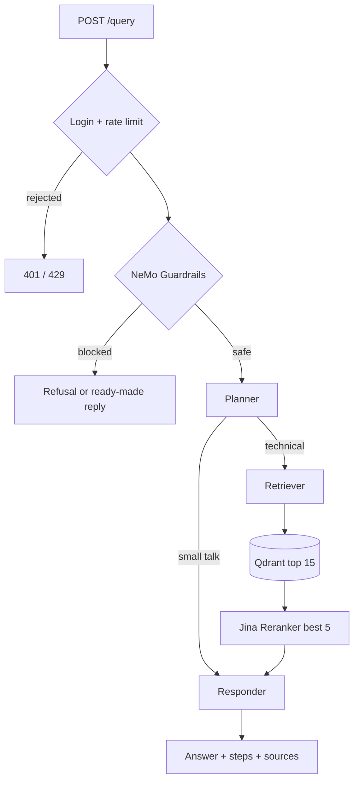
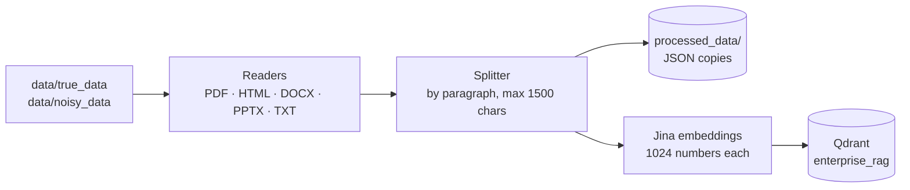

# Architecture

This guide explains how the system is built: what happens when someone asks a question, how documents are loaded, which services support the app, and how answer quality is measured.

## System overview

```mermaid
graph LR

    %% ── Interfaces ───────────────────────────────────────────────────────────
    subgraph UI ["🖥️  Interface Layer"]
        direction TB
        CHAT["Streamlit\nChat UI"]
        EVAL_UI["Streamlit\nEval App"]
    end

    %% ── API + Safety ─────────────────────────────────────────────────────────
    subgraph SAFETY ["🛡️  API + Safety"]
        direction TB
        API["⚡ FastAPI\n/query"]
        GR{"NeMo\nGuardrails"}
    end

    %% ── LangGraph Agent ──────────────────────────────────────────────────────
    subgraph AGENT ["🧠  LangGraph Agentic Core"]
        direction TB
        PL["🗺️ Planner\nIntent Classification"]
        RT["🔍 Retriever\nVector Search"]
        RS["💬 Responder\nAnswer Generation"]
        MEM[("💾 Postgres Checkpointer\nNeon · conversation state")]
    end

    %% ── Retrieval ────────────────────────────────────────────────────────────
    subgraph RETRIEVAL ["🔎  Retrieval Layer"]
        direction TB
        QD[("🗄️ Qdrant Cloud\nVector DB")]
        FR["⚡ Jina Reranker\nAPI · jina-reranker-v3"]
    end

    %% ── LLM Gateway ──────────────────────────────────────────────────────────
    subgraph GATEWAY ["🌐  LLM Gateway"]
        direction TB
        PK["🔀 Portkey\nUnified Gateway"]
        G1["🤖 OpenAI Primary\ngpt-5-mini · via Portkey"]
        G2["🤖 Anthropic Fallback\nclaude-haiku-4-5 · via Portkey"]
    end

    %% ── Ingestion ────────────────────────────────────────────────────────────
    subgraph INGEST ["📥  Ingestion Pipeline"]
        direction TB
        LOADER["Document Loaders\nPDF · HTML · DOCX · PPTX · TXT"]
        PARSED[("📁 processed_data/\nLocal JSON Chunks")]
        EMB["🔢 Jina Embeddings\njina-embeddings-v3 · 1024-dim · API"]
    end

    %% ── Observability ────────────────────────────────────────────────────────
    subgraph OBS ["📡  Observability"]
        direction LR
        LF["🔥 Pydantic\nLogfire"]
        LS["🦜 LangSmith\nTracing"]
    end

    %% ── Evals ────────────────────────────────────────────────────────────────
    subgraph EVALS ["🧪  RAGAS Evaluation Suite"]
        direction LR
        GD[("📋 Golden Dataset\n15 Samples · 6 Guardrail Tests")]
        RAGAS["RAGAS Metrics\nFaithfulness · Relevancy\nPrecision · Recall · Correctness"]
        TC["Tool Correctness\nJaccard · Zero LLM"]
        JUDGE["⚖️ Judge LLM\nOpenAI · JUDGE_OPENAI_API_KEY"]
    end

    %% ── Main Query Flow ──────────────────────────────────────────────────────
    CHAT -->|query| API
    API --> GR
    GR -->|"❌ blocked"| CHAT
    GR -->|"✅ pass"| PL
    PL -->|conversational| RS
    PL -->|technical| RT
    RT --> QD
    QD --> FR
    FR --> RS
    RS --> PK
    PL --> PK
    PK --> G1
    PK -.->|fallback| G2
    RS -.-> MEM
    MEM -.-> PL

    %% ── Ingestion Flow ───────────────────────────────────────────────────────
    LOADER --> PARSED
    PARSED --> EMB
    EMB --> QD

    %% ── Eval Flow ────────────────────────────────────────────────────────────
    EVAL_UI -->|phase 1| API
    GD --> RAGAS
    GD --> TC
    RAGAS --> JUDGE

    %% ── Observability Traces ─────────────────────────────────────────────────
    API -.->|spans| LF
    AGENT -.->|traces| LS

    %% ── Colors ───────────────────────────────────────────────────────────────
    classDef ui        fill:#3B82F6,stroke:#1D4ED8,color:#fff,rx:8
    classDef safety    fill:#EF4444,stroke:#B91C1C,color:#fff,rx:8
    classDef agent     fill:#8B5CF6,stroke:#6D28D9,color:#fff,rx:8
    classDef retrieval fill:#10B981,stroke:#047857,color:#fff,rx:8
    classDef gateway   fill:#F59E0B,stroke:#B45309,color:#fff,rx:8
    classDef ingest    fill:#6366F1,stroke:#4338CA,color:#fff,rx:8
    classDef obs       fill:#14B8A6,stroke:#0F766E,color:#fff,rx:8
    classDef evals     fill:#EC4899,stroke:#BE185D,color:#fff,rx:8
    classDef memory    fill:#7C3AED,stroke:#5B21B6,color:#fff,rx:8

    class CHAT,EVAL_UI ui
    class API,GR safety
    class PL,RT,RS agent
    class QD,FR retrieval
    class PK,G1,G2 gateway
    class LOADER,PARSED,EMB ingest
    class LF,LS obs
    class GD,RAGAS,TC,JUDGE evals
    class MEM memory
```

## What happens when a question is asked

A request to `POST /query` goes through five steps.

1. **API (FastAPI).** `app/main.py` checks the request (`q` = question, `thread_id` = conversation ID). If `RAG_API_KEY` is set, the caller must send it as a **bearer token**. Each client is limited to `RATE_LIMIT_PER_MINUTE` requests. Every request gets a request ID and is traced in Logfire.
2. **Guardrails (NeMo Guardrails).** Before any search or LLM call, the question is checked against the rules in `app/guardrails/colang_rules.py`, written in NeMo's rule language, **Colang**. Off-topic and jailbreak questions are refused. Greetings and "what can you do?" questions get a ready-made reply. A blocked request returns straight away with `status: "Blocked by guardrails."` and never reaches the agent.
3. **Planner (LangGraph).** `app/agents/nodes/planner.py` reads the full chat history for the `thread_id`. It then either marks the message as small talk or rewrites it into a complete search question. For example, "how do I scale it?" becomes a full question about the topic from earlier in the chat. Small talk goes straight to the responder; technical questions go to the retriever.
4. **Retriever.** `app/agents/nodes/retriever.py` turns the question into an **embedding** (a list of 1024 numbers) with Jina `jina-embeddings-v3`. It finds the 15 closest chunks in Qdrant, then uses the Jina reranker (`jina-reranker-v3`) to keep the best 5.
5. **Responder.** `app/agents/nodes/responder.py` writes the final answer from those chunks and the chat history. All LLM calls go through the Portkey gateway.

The response contains the answer, `thought_process` (the steps the agent took), a status message and the source chunks used.

## Main parts

### Agent — `app/agents/`

The agent is a LangGraph `StateGraph` with three steps (**nodes**): `planner`, `retriever` and `responder`. After the planner, a **conditional edge** decides which step runs next. The shared state (`app/agents/state.py`) holds the messages, the current question, the retrieved documents, the list of steps taken and a status message.

Chat history is saved per `thread_id` in Postgres (Neon) using a LangGraph **checkpointer**. One database setup command (`CREATE INDEX CONCURRENTLY`) can't run inside a transaction on Neon, so setup runs on its own connection. If Postgres is down at startup, the app keeps chat history in memory (`MemorySaver`) and logs a warning; that history is lost on restart.

### LLM gateway — `app/gateway/`

Every LLM call goes through **Portkey**, which works like the OpenAI API. Which model to use, retries and the backup model are set in a saved Portkey config (`PORTKEY_PRIMARY_CONFIG_ID`). OpenAI `gpt-5-mini` is the main model and Anthropic `claude-haiku-4-5` is the backup. The module provides a LangChain `ChatOpenAI` client for the agent steps, plus regular and async OpenAI clients. Each call is tagged with the step that made it (planner, responder, …), so usage can be tracked per step in Portkey.

### Guardrails — `app/guardrails/`

NeMo Guardrails uses OpenAI `gpt-5-mini` to work out what kind of question it is (its **intent**). The rules are:

| Rule | What it does |
|---|---|
| Off-topic | Refuses questions outside the supported technical topics |
| Jailbreak | Refuses prompt-injection and "ignore your instructions" attempts |
| Greeting | Replies to greetings without running the agent |
| Capabilities | Explains what the assistant can help with |

### Search services — `app/services/retrieval/`

| File | What it does |
|---|---|
| `embedding.py` | Calls the Jina Embeddings API in batches, with retries. If Jina is down, it uses a local backup model (`mxbai-embed-large-v1`). |
| `qdrant_service.py` | Searches the `enterprise_rag` collection by **cosine similarity**, with retries. If the search still fails, it returns no results instead of crashing. |
| `ranking_service.py` | Calls the Jina Reranker API. If it fails, it keeps the original search order instead of failing the request. |

### Loading documents (ingestion) — `app/ingestion/`

`processor.py` goes through every file in the folder, picks the right reader for its type, splits the text into chunks and saves them to Qdrant. Each chunk is stored with its file name and its type (`true` or `noisy`). `--wipe` clears the collection first and recreates it with the right vector size. A JSON copy of every chunk is also written to `processed_data/` so you can inspect it; this folder is created automatically and not committed to git.

All reading happens locally: `pypdf` for PDFs (with `pdfplumber` as a backup for pages with no text), BeautifulSoup for HTML and `unstructured` for Office files.

### Health checks, metrics and monitoring

| Endpoint | What it does |
|---|---|
| `GET /health` | Is the app running? (**liveness**) |
| `GET /ready` | Are Postgres, Redis, Qdrant, the LLM gateway and both Jina services reachable? (**readiness**) |
| `GET /metrics` | Prometheus metrics: standard HTTP metrics plus `rag_requests_total`, `rag_request_duration_seconds` and `guardrails_blocks_total` |
| `GET /graph` | Picture of the LangGraph workflow |

**Pydantic Logfire** traces each request through the API, guardrails, search and reranking. **LangSmith** traces each agent step. `python -m app.services.health.connection_checker` runs the same checks as `/ready` without starting the server.

### Rate limiting

SlowAPI limits requests per client IP address. The counts are stored in Upstash Redis, so the limit works even when several copies of the API are running. If Redis is down, the counts are kept in memory instead.

## Dataset

The documents in `data/` are split on purpose to test how precise the search is:

| Folder | Contents | Purpose |
|---|---|---|
| `true_data/` | 6 Kubernetes documents (DOCX, PPTX, HTML, TXT) | The knowledge the assistant should answer from |
| `noisy_data/` | 58 unrelated technical documents (papers, manuals, slides) | Noise that the search and reranker must filter out |

## Evaluation — `evals/`

The evaluation tests the running system end to end against a **golden dataset** (`evals/datasets/golden_dataset.json`): 15 questions with known correct answers, plus 6 guardrail test cases.

| Step | File | What it does |
|---|---|---|
| 1. Collect | `pipeline.py` | Sends each test question to `/query` and saves the answer, the retrieved chunks and the agent's steps |
| 2. Score | `metrics.py` | Uses RAGAS with a separate "judge" LLM to score faithfulness, answer relevancy, context precision, context recall and answer correctness. Also scores **tool correctness** (did the agent search when it should?) using Jaccard similarity, which needs no LLM |
| 3. Guardrails | `guardrails_eval.py` | Labels each guardrail test as a true/false positive or negative (TP / TN / FP / FN) and calculates precision and recall |

`run_evals.py` runs every step from the command line and saves `evals/report.json`. `evals/app.py` runs the same steps in a Streamlit dashboard. `data_parser.py` reads the source documents into labelled chunks, which were used to write the golden answers.

## Deployment overview

One Docker image is used for both the API and the UI, each started with a different command. They run as two ECS Fargate services behind an Application Load Balancer. All data lives in managed services (Qdrant Cloud, Neon Postgres, Upstash Redis), so the containers hold no data of their own and can scale out easily. See [deployment.md](deployment.md) for details.
