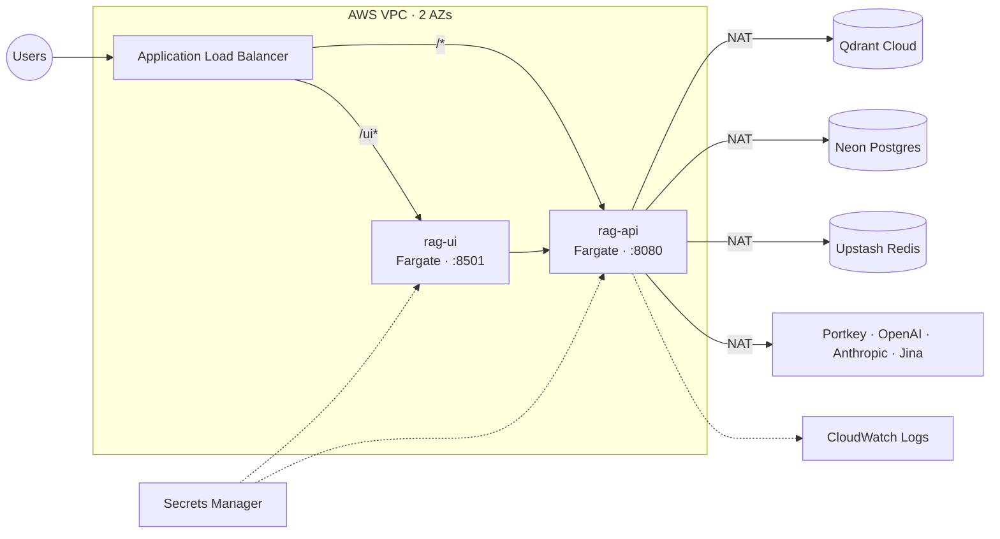
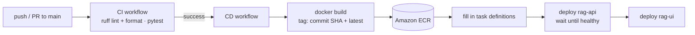

# Deployment

The app runs on **AWS ECS Fargate**, which runs containers without you managing any servers. An **Application Load Balancer (ALB)** sends incoming traffic to them. All data is stored in managed services outside AWS, so the containers hold no data themselves and you can add more copies when traffic grows (**horizontal scaling**). GitHub Actions builds and deploys every new version.

## How it is set up



### Containers

| Service | Start command | Size | Scaling |
|---|---|---|---|
| `rag-api` | `uvicorn app.main:app --host 0.0.0.0 --port 8080` | 1 vCPU / 2 GB | 2–10 copies, based on requests per copy |
| `rag-ui` | `streamlit run ui/app.py --server.port 8501` | 0.5 vCPU / 1 GB | 1–4 copies, based on CPU use (target 70%) |

Both services use the same Docker image from Amazon ECR; only the start command is different. Their settings (**task definitions**) are in `.aws/task-definitions/`.

### External services

| What | Provider | Used for |
|---|---|---|
| Vector database | Qdrant Cloud | `enterprise_rag` collection (1024-dimension vectors, cosine similarity) |
| Postgres | Neon | Chat memory (LangGraph checkpointer) |
| Redis | Upstash | Shared rate-limit counts |
| Secrets | AWS Secrets Manager | API keys and connection strings, passed to the containers at start-up |
| Logs | Amazon CloudWatch | `/ecs/rag-api` and `/ecs/rag-ui` |

Qdrant Cloud is used instead of running Qdrant ourselves on Fargate. That keeps every container free of data, avoids slow network storage on each search, and leaves backups and uptime to the provider.

### Network

| Part | Where it runs |
|---|---|
| Load balancer, NAT gateway | Public subnets in two **availability zones (AZs)** |
| Containers | Private subnets (no public IP); they reach the internet through the **NAT gateway** |

| Firewall (security group) | Allows in | For |
|---|---|---|
| `rag-alb-sg` | Ports 80/443 from the internet | Load balancer |
| `rag-api-sg` | Port 8080 from the load balancer only | API containers |
| `rag-ui-sg` | Port 8501 from the load balancer only | UI containers |

The load balancer sends `/ui*` to the UI (health check: `/_stcore/health`) and everything else to the API (health check: `/health`).

## Settings and secrets

Sensitive values are stored in Secrets Manager under the `rag/` prefix, and the task definitions refer to them by **ARN** (their AWS ID):

`NEON_DB_URL`, `UPSTASH_REDIS_REST_URL`, `UPSTASH_REDIS_REST_TOKEN`, `QDRANT_URL`, `QDRANT_API_KEY`, `OPENAI_API_KEY`, `JINA_API_KEY`, `PORTKEY_API_KEY`, `RAG_API_KEY`, `LOGFIRE_TOKEN`, `LANGSMITH_API_KEY`

Non-sensitive settings (`QDRANT_COLLECTION`, `RATE_LIMIT_PER_MINUTE`, `PORTKEY_PRIMARY_CONFIG_ID`, the Portkey provider names, `BACKEND_URL`) are plain environment variables. The containers are only allowed to read these specific secrets (`secretsmanager:GetSecretValue`) and nothing else.

## Deployment scripts

| Script | What it does |
|---|---|
| `scripts/deployment/aws_deploy_env.sh` | Shared names and IP ranges (region, VPC, cluster, ECR repository) |
| `scripts/deployment/create_aws_secrets.py` | Creates all secrets in Secrets Manager from `.env` and saves their ARNs to `aws_secret_arns.sh` |
| `scripts/deployment/render_task_defs.py` | Fills the task definition templates with the image, secret ARNs and backend URL |
| `scripts/deployment/destroy_aws_deployment.sh` | Deletes every AWS resource in the right order |
| `aws_secret_arns.example.sh`, `aws_deploy_state.example.sh` | Templates for the two local settings files |

`aws_secret_arns.sh` and `aws_deploy_state.sh` contain your real AWS account and resource IDs, so git ignores them. Only the `.example.sh` templates are committed.

## Setting up AWS

You need the AWS CLI (v2), logged in with permission to create VPC, ECS, ECR, load balancer, IAM and Secrets Manager resources. Start by loading the shared settings:

```bash
source scripts/deployment/aws_deploy_env.sh
cp scripts/deployment/aws_deploy_state.example.sh scripts/deployment/aws_deploy_state.sh
```

As you create each resource, write its ID into `aws_deploy_state.sh`. Create them in this order:

1. **Network.** A VPC (`10.0.0.0/16`, DNS hostnames on), an internet gateway, two public and two private subnets across two AZs, one NAT gateway with an Elastic IP, and public and private route tables.
2. **Firewalls.** The `rag-alb-sg`, `rag-api-sg` and `rag-ui-sg` security groups, with the rules above.
3. **External services.** Create the Neon database, the Upstash Redis database (with its REST API on) and the Qdrant Cloud cluster, and add their details to `.env`. You don't need to create the Qdrant collection yourself; the ingestion step does it.
4. **Image registry (ECR).** `aws ecr create-repository --repository-name enterprise-rag --image-scanning-configuration scanOnPush=true`, plus a rule that keeps only the last 30 images.
5. **Logs.** `aws logs create-log-group --log-group-name /ecs/rag-api` (and `/ecs/rag-ui`).
6. **Secrets.** `python scripts/deployment/create_aws_secrets.py`. If `.env` has no `RAG_API_KEY`, it creates a strong one for you.
7. **Permissions (IAM).** Make sure `ecsTaskExecutionRole` exists with the `AmazonECSTaskExecutionRolePolicy` policy. Create `rag-api-task-role` and `rag-ui-task-role`, and give them a `rag-read-secrets-policy` that can read only the secrets from step 6.
8. **Cluster.** `aws ecs create-cluster --cluster-name rag-cluster --capacity-providers FARGATE FARGATE_SPOT --settings name=containerInsights,value=enabled`.
9. **Load balancer.** A public ALB in the public subnets, with two **target groups**: `rag-api-tg` (port 8080) and `rag-ui-tg` (port 8501). Add an HTTP listener on port 80 that sends traffic to the API by default, and a rule that sends `/ui*` to the UI.
10. **Task definitions.** `python scripts/deployment/render_task_defs.py`, then `aws ecs register-task-definition --cli-input-json file:///tmp/rag-api.json` (and `rag-ui.json`).
11. **Services.** `aws ecs create-service` for `rag-api` (2 copies) and `rag-ui` (1 copy) in the private subnets, linked to their target groups. Use a 60-second health-check grace period and `minimumHealthyPercent=100`, so old copies keep running until new ones are healthy.
12. **Auto scaling.** Register both services with Application Auto Scaling and add the scaling rules from the containers table.

## CI/CD



- **`ci.yml`** runs on every push and pull request to `main`. It runs the Ruff code checks on `app`, `evals`, `scripts`, `tests` and `ui`, then the pytest tests with dummy settings.
- **`cd.yml`** runs after CI passes on `main`, if the repository variable `DEPLOY_ENABLED` is `true`. You can also start it manually with *Run workflow*. It builds the image, uploads it to ECR tagged with the commit ID (SHA), fills in both task definitions and deploys them, waiting until the API is healthy.

**GitHub secrets you need:** `AWS_ACCESS_KEY_ID`, `AWS_SECRET_ACCESS_KEY`, `AWS_REGION`, `BACKEND_URL`, and one `*_ARN` secret for each Secrets Manager entry. `ECR_REPOSITORY`, `ECS_CLUSTER`, `ECS_SERVICE_API` and `ECS_SERVICE_UI` are optional. If you leave them out, they default to `enterprise-rag`, `rag-cluster`, `rag-api` and `rag-ui`.

```bash
gh secret set AWS_REGION --body "$AWS_REGION"
gh secret set QDRANT_API_KEY_ARN --body "$QDRANT_API_KEY_ARN"
# …one per secret
gh variable set DEPLOY_ENABLED --body true
```

## Docker image

The `Dockerfile` starts from `python:3.11-slim-bookworm`:

- Dependencies are installed with `uv` in their own layer, so rebuilding after a code-only change is fast.
- Only `app/` and `ui/` are copied in. Data, evals, docs and tests are left out by `.dockerignore`.
- System packages are updated during the build to include the latest security fixes.
- The app runs as a normal user (`appuser`), not as root.

## Loading documents in production

Loading documents (ingestion) is a one-off job, not something that runs all the time. Run it from your computer or a CI runner that can reach Qdrant. You can also run it as a one-off Fargate task (`aws ecs run-task`) with the documents copied into the task first.

```bash
pip install -r requirements.txt
python -m app.ingestion.processor data --wipe
```

## Checking the deployment

```bash
export API_URL="http://<alb-dns-name>"

curl -s "$API_URL/health"
curl -s "$API_URL/ready"
curl -s -X POST "$API_URL/query" \
  -H "Content-Type: application/json" \
  -H "Authorization: Bearer $RAG_API_KEY" \
  -d '{"q": "What is a Kubernetes pod?", "thread_id": "smoke-test"}'

aws logs tail /ecs/rag-api --follow
```

The chat UI is at `http://<alb-dns-name>/ui`.

## Monitoring

- **CloudWatch** stores the container logs. Useful alarms: more than 1% of requests returning 5xx errors at the load balancer, or any unhealthy containers.
- **Prometheus** can read `GET /metrics` for `/query` response times, request counts by status and how often guardrails block requests.
- **Logfire** and **LangSmith** trace requests and agent steps in production, just like they do locally.

## Removing everything

```bash
bash scripts/deployment/destroy_aws_deployment.sh
```

The script scales the services down to zero, then deletes everything in this order: auto scaling, ECS services and task definitions, the load balancer and target groups, the cluster, the ECR repository, the secrets, the IAM roles and policy, the log groups, the NAT gateway and Elastic IP, route tables, subnets, the internet gateway, the security groups and the VPC. Delete the Neon, Upstash and Qdrant Cloud resources from their own websites.

## Running the production setup locally

`docker-compose.yml` runs the same image on your machine: `api` on port 8000, `ui` on port 8501, plus an optional local Qdrant on port 6333. Settings come from `.env`.

```bash
docker compose up --build
```
